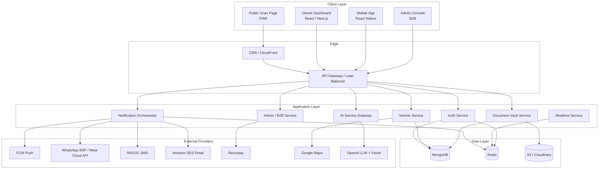
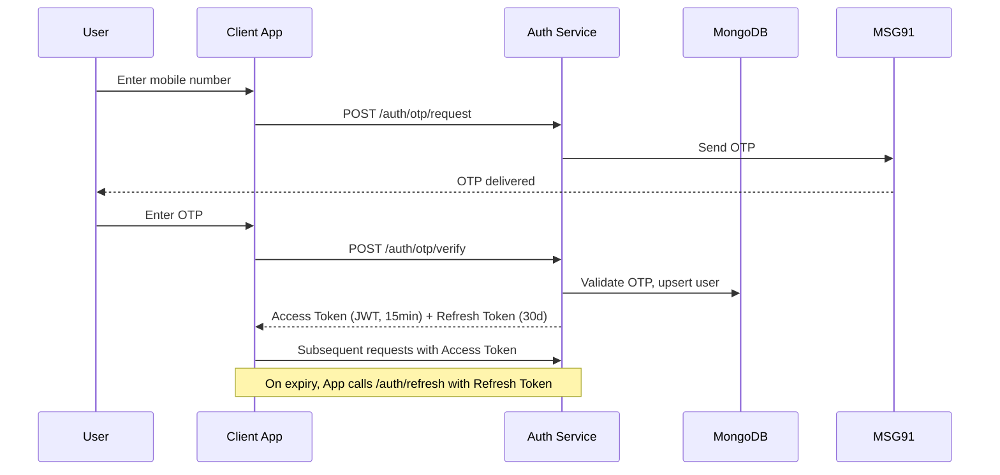
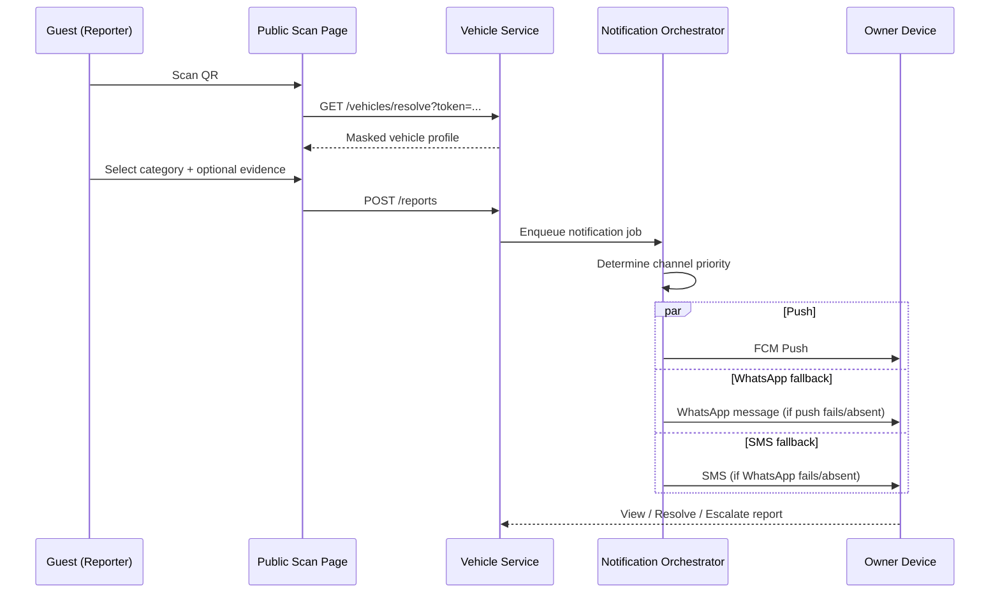
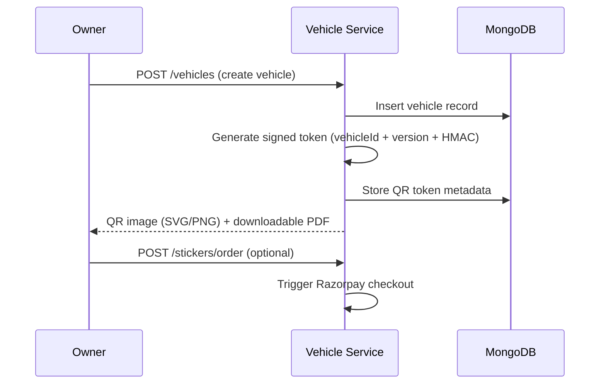
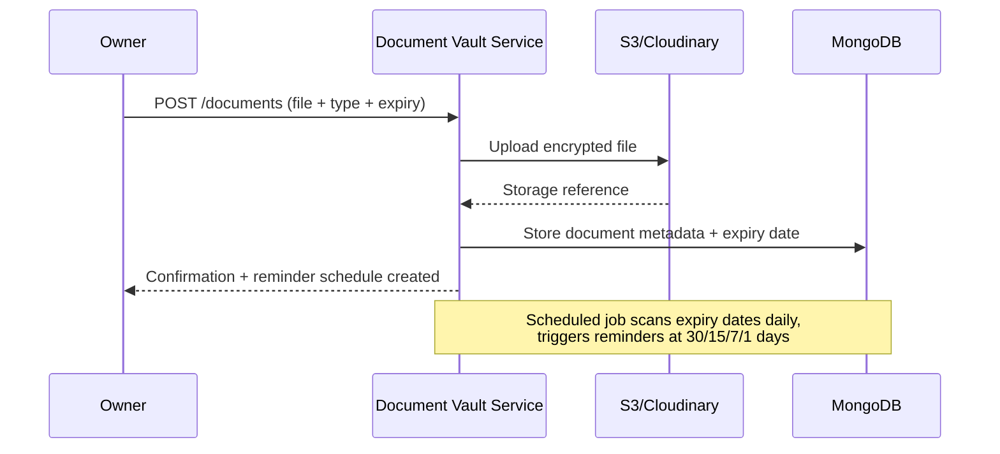
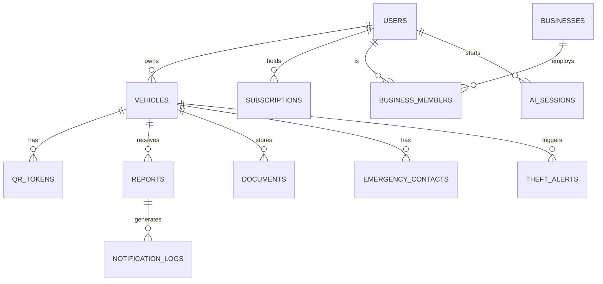

# RoadLink

### _Connecting People Through Vehicles_

**Startup Blueprint & Complete Technical/Business Specification**
Prepared for: Founding Team, India
Document Type: SRS + PRD + TDD + Business Plan

---

## Tagline

**"Every Vehicle. One Identity. One Scan Away."**

## Mission

To give every vehicle in India a secure, private, and instantly reachable digital identity — so that any citizen can alert an owner about their vehicle in seconds, without ever seeing a phone number, and without either party needing an app.

## Vision

To become the national digital identity layer for vehicles — the default way people communicate about parking, safety, emergencies, and vehicle-related events — expanding from private cars and two-wheelers into fleets, delivery riders, school buses, taxis, rentals, and eventually municipal and RTO-linked infrastructure.

## Problem Statement (Summary)

There is no safe, standardized, privacy-preserving way for a stranger to contact a vehicle owner. Today this happens through:

- Handwritten phone numbers on windshields (privacy risk, weathering, misuse)
- Shouting / confrontation in parking lots
- No mechanism at all for hit-and-run, theft, or "lights left on" situations

Existing tools (parking apps, RTO portals, insurance apps) solve narrow slices but none solve the core "stranger-to-owner, privacy-safe, real-time" communication problem.

## Market Opportunity (Summary)

India has one of the largest vehicle parks in the world, heavily two-wheeler dominated, with dense urban parking conflict, high hit-and-run incidence, and a fast-growing QR/UPI-literate population primed for scan-based interactions. Full sizing is in Section 3.

## Target Users

- Private vehicle owners (2W/4W)
- Housing societies & apartment complexes
- Corporate office parking
- Hotels & guest parking
- Fleet operators (delivery, cabs, logistics)
- School transport operators
- Parking lot operators
- Insurance and service-center partners (B2B2C channel)

## Business Goals

1. Reach 100,000 registered vehicles within 18 months of launch, concentrated in 2–3 pilot cities.
2. Convert 8–12% of free users to premium within Year 1.
3. Sign 50+ B2B accounts (societies, hotels, corporate parks) within Year 1.
4. Establish at least one insurance/RTO-adjacent partnership within Year 2.
5. Achieve monthly notification volume sufficient to be a genuine public-safety utility, not just an app.

## Long-Term Vision

RoadLink evolves from a QR-notification tool into a **vehicle-of-record platform**: the place where a vehicle's identity, documents, service history, insurance status, and emergency profile live — interoperable with FASTag, insurance verification, PUC checks, and (where partnerships allow) RTO and police reference systems. Longer term, this connects into a broader "DigitalSeva" ecosystem of renewal reminders and trusted service-provider referrals, turning a safety utility into a lifetime vehicle-ownership companion.

---

# SECTION 1 — Executive Summary

RoadLink is a privacy-first, QR-based digital identity platform for vehicles, built for the Indian market and designed to scale globally. Every vehicle registered on RoadLink receives a unique, tamper-resistant QR code. Anyone — with or without the RoadLink app — can scan the code with any phone camera and land on a secure public web page. From there, they can notify the vehicle owner about specific situations (wrong parking, accident, theft, headlights on, etc.) without ever seeing the owner's phone number or personal identity.

The owner receives the alert instantly through whichever channel is available and appropriate (push notification, WhatsApp, SMS, or email), with full context: category, location, time, and any photo/video evidence attached.

Beyond the core notification loop, RoadLink layers in a document vault (RC, insurance, PUC, license), renewal reminders, live GPS sharing for family/fleet use cases, and a suite of AI features (AI Mechanic, AI Damage Detection, AI Accident Assistant, AI Insurance Assistant, AI Vehicle Health, and a general AI chat concierge).

The business model is freemium: the core safety/notification loop is free forever (this is the growth engine and the public-good hook), while document vault, AI features, live tracking, and family sharing sit behind a premium subscription. A parallel B2B line serves apartments, hotels, corporate parks, and fleets. A physical-goods line (weatherproof QR/NFC stickers) provides a durable, recurring point of contact with every user and a natural upsell surface.

This document is the complete blueprint — product, technical architecture, database design, API design, security, cost modeling, team plan, timeline, and go-to-market — sufficient for an engineering team to begin building without further clarification.

---

# SECTION 2 — Problem Statement

## 2.1 Current Problems

| Problem                           | Description                                                                            | Impact                                                             |
| --------------------------------- | -------------------------------------------------------------------------------------- | ------------------------------------------------------------------ |
| No safe stranger-to-owner channel | Phone numbers written on dashboards/windshields are the only real-world solution today | Privacy exposure, stalking/misuse risk, faded/illegible in weather |
| Hit-and-run has no evidence trail | Passersby have no structured way to report damage with photo/video/time/location       | Owners discover damage late, with no evidence for insurance claims |
| Theft reporting is fragmented     | Owners rely on police + word of mouth                                                  | Slow community response, low recovery rates                        |
| Document management is manual     | RC, insurance, PUC, license tracked on paper or scattered photos                       | Missed renewals, fines, invalid insurance at time of accident      |
| Parking conflicts escalate        | No low-friction way to ask someone to move a car                                       | Confrontations, vandalism, disputes in societies/offices           |
| Fleet/family visibility is siloed | Parents, societies, and fleet managers use disconnected tools                          | No unified "where is this vehicle / who owns it" layer             |

## 2.2 Existing Solutions (Landscape)

- **"Call me" dashboard cards / stickers** — a printed card with a number or masked number. Zero verification, no notification categories, no evidence capture, easily lost or copied.
- **Parking apps (society/commercial)** — solve slot allocation and visitor management but not stranger-to-owner communication for a vehicle already parked.
- **Insurance apps** — document storage for a single insurer's policy only; no cross-document vault, no QR, no notification layer.
- **Fleet/GPS trackers** — solve live tracking for a fleet operator but require hardware and are not consumer-facing or QR-based.
- **Generic "find my car" apps** — help the _owner_ find their own car; do not help a _stranger_ reach the owner.

## 2.3 Competitor Analysis

| Competitor Type                                                   | Example Category                          | Strengths                                              | Weaknesses                                                                                                                              |
| ----------------------------------------------------------------- | ----------------------------------------- | ------------------------------------------------------ | --------------------------------------------------------------------------------------------------------------------------------------- |
| QR "Call Me" dashboard cards (unbranded, sold on Amazon/Flipkart) | Physical sticker with masked-call service | Very cheap, simple, no app needed                      | No document vault, no categorized alerts, no evidence upload, no theft/community network, weak trust/verification, no renewal reminders |
| Society/parking management SaaS                                   | e.g. ADDA, MyGate-style tools             | Strong in visitor management, deep in single societies | Not built for stranger-initiated, cross-society vehicle contact; no public QR identity layer                                            |
| Vehicle document wallet apps                                      | Standalone RC/insurance storage apps      | Good single-purpose document storage                   | No notification layer, no QR, no community/safety angle                                                                                 |
| Fleet telematics platforms                                        | Enterprise GPS/fleet tools                | Deep fleet analytics, hardware integration             | Expensive, B2B-only, irrelevant to individual owners, no consumer touchpoint                                                            |

## 2.4 Weaknesses of Competitors (Synthesis)

1. Every existing player solves **one slice** (calling, documents, tracking, or parking) — none unify identity + notification + documents + AI in one QR-anchored profile.
2. None guarantee **phone-number privacy by design** with a verifiable, branded trust layer ("Vehicle Verified").
3. None have a **community theft-alert network** triggered from the same QR infrastructure.
4. None pair the safety utility with **AI-driven diagnostics and insurance guidance**, which is where long-term retention and premium revenue live.

## 2.5 How RoadLink Is Better

- **Privacy-by-design**: number is never exposed, at any tier, to any scanner.
- **Zero install requirement** for the reporting party — the entire safety loop works from any phone's default camera.
- **Category-specific alerts** (12+ situations) instead of a single generic "call" button, enabling structured, evidence-rich reports.
- **One identity, many use cases**: the same QR anchors emergency contact, document vault, renewal reminders, AI diagnostics, and community theft alerts — creating switching costs and daily/weekly relevance, not just an emergency-only tool.
- **B2B expansion built in from day one**: the same core QR primitive extends to apartment/hotel/parking/fleet use cases without re-architecture.

---

# SECTION 3 — Market Research

## 3.1 Indian Market Context

India has one of the largest and fastest-growing vehicle populations globally, with two-wheelers forming the majority of the on-road fleet and continued double-digit growth in new vehicle registrations in recent years. Dense urban housing (apartment societies, mixed-use commercial parking) creates constant low-grade parking conflict, and India's QR-literacy is unusually high due to UPI payment habits — the population is already trained to scan first, ask questions later. This is a strong behavioral tailwind for a QR-anchored consumer product.

_(Note: exact current vehicle-registration and ownership figures should be sourced from the Ministry of Road Transport & Highways' VAHAN dashboard and updated at time of investor deck preparation, as these figures change year over year.)_

## 3.2 Global Market

Vehicle-identity and "contactless owner contact" concepts exist in fragmented form in several markets (parking-notice QR stickers in the US/UK, dashboard call-masking apps in Southeast Asia), but no dominant global platform has unified identity + notification + documents + AI. This leaves room for an India-first platform to expand into other high-density, QR-literate markets (Southeast Asia, Middle East) post-domestic scale.

## 3.3 Potential Users

- Individual 2-wheeler and 4-wheeler owners (primary consumer base)
- Parents of teen/young-adult drivers (family tracking angle)
- Renters of two-wheelers/cars (short-term identity binding)

## 3.4 Potential Businesses (B2B)

- Apartment/housing societies (visitor + resident parking)
- Corporate office parks
- Hotels and resorts (guest parking)
- Mall and commercial parking operators
- Delivery and logistics fleets (last-mile riders)
- School transport operators
- Cab/taxi aggregators (as a value-add for driver-partners)
- Automobile dealerships and service centers (as a QR-at-point-of-sale channel)
- Insurance companies (renewal + claims-assist partnership channel)

## 3.5 Future Expansion Opportunities

- Municipal parking authorities (QR-linked parking enforcement)
- RTO-integrated digital RC/insurance verification
- Police reference integration for stolen-vehicle reporting
- Rental and shared-mobility platforms (bikes, scooters, cars)
- Cross-border expansion to other high-density Asian markets

---

# SECTION 4 — Business Model

## 4.1 Revenue Streams Overview

| Stream                             | Type                                     | Target Segment                           | Notes                                                           |
| ---------------------------------- | ---------------------------------------- | ---------------------------------------- | --------------------------------------------------------------- |
| Premium subscription               | B2C recurring                            | Individual owners                        | AI features, document vault, family sharing, live tracking      |
| QR/NFC sticker sales               | B2C one-time (recurring via replacement) | All users                                | Weatherproof QR, NFC+QR combo, reflective variants              |
| Fleet subscriptions                | B2B recurring                            | Delivery, logistics, cabs                | Per-vehicle or per-seat pricing                                 |
| Apartment/society subscriptions    | B2B recurring                            | Housing societies                        | Per-society flat fee or per-unit                                |
| Hotel subscriptions                | B2B recurring                            | Hospitality                              | Guest-parking module                                            |
| Parking operator subscriptions     | B2B recurring                            | Commercial parking lots                  | Slot-level QR + staff notification tools                        |
| Government/RTO partnerships        | B2G, longer-term                         | State transport departments              | Verification API licensing, pilot programs                      |
| Insurance partnerships             | B2B2C referral/commission                | Insurers                                 | Renewal referral, claims-assist guidance                        |
| Automobile service center tie-ups  | B2B2C referral                           | Service chains, dealerships              | Maintenance reminder → booking referral                         |
| Advertising (light-touch)          | B2B                                      | Auto-adjacent brands only                | Non-intrusive, contextual only (e.g., insurance renewal banner) |
| Affiliate                          | B2B2C                                    | Insurance, tyres, batteries, accessories | Commission-based, triggered by renewal reminders                |
| Future AI services (API licensing) | B2B                                      | Insurers, fleet platforms                | License damage-detection / diagnostic AI as a service           |

## 4.2 Free Tier

- QR code generation and vehicle profile
- All 12+ core notification categories
- Vehicle search by number (privacy-safe)
- Basic renewal reminders (RC, insurance, PUC)
- One vehicle per account

## 4.3 Premium Tier (B2C)

- Unlimited vehicles per account
- Family member sharing and multi-user access
- Full document vault with encrypted cloud backup
- All AI features (Mechanic, Damage Detection, Insurance Assistant, Vehicle Health, Chat)
- Live GPS / family tracking
- Full accident report history and location history
- Priority support

**Indicative pricing (to be validated in pilot):** ₹99–₹149/month or ₹799–₹999/year per account (covering multiple vehicles).

## 4.4 Business Tier (B2B)

- Society/apartment: flat monthly fee scaled by number of units, includes visitor parking QR + admin dashboard
- Hotel: per-property monthly fee, guest-parking module
- Corporate: per-employee or flat-site fee
- Fleet: per-vehicle monthly fee with fleet dashboard, bulk QR issuance, live tracking
- Parking operator: per-slot or per-facility fee with staff notification console

## 4.5 QR/NFC Sticker Sales

- Standard weatherproof QR sticker (bundled free with signup — 1 per account)
- Premium reflective QR sticker (paid add-on)
- NFC + QR combo tag (paid, premium)
- Replacement stickers (paid, recurring revenue driver)

---

# SECTION 5 — Complete Feature List

## 5.1 MVP (Launch)

- User registration (mobile OTP), login, JWT session management
- Vehicle profile creation (make, model, number, optional owner name)
- Unique QR code generation per vehicle
- Public scan landing page (no login required) showing masked identity + category buttons
- 12 notification categories: Wrong Parking, Blocking Road, Hit & Run, Vehicle Damage, Fire, Vehicle Theft, Tow Alert, Headlights On, Windows Open, Emergency, Lost Vehicle, Abandoned Vehicle, Accident Alert
- Notification delivery via Push (FCM) + SMS fallback
- Search vehicle by registration number (privacy-safe, no number shown)
- Basic document vault (RC, Insurance, PUC, License) — upload & store only
- Basic renewal reminders (date-based, push/SMS)
- Owner dashboard (web + PWA): vehicles, notifications received, documents
- QR sticker ordering flow (address, payment via Razorpay)
- Privacy-safe reporting flow with optional photo upload for Hit & Run / Damage

## 5.2 Version 2

- WhatsApp Business API notification channel
- Theft Alert community broadcast (nearby registered users)
- Live GPS sharing (family tracking, opt-in, time-boxed)
- AI Mechanic (symptom-based diagnostic chat)
- AI Damage Detection (photo upload → damage classification + estimated cost)
- Document vault encryption at rest + expiry-based smart reminders (variable lead time by document type)
- Family member multi-user accounts with role-based visibility
- Society/Apartment admin console (bulk resident onboarding, visitor QR)
- In-app evidence timeline per vehicle (all reports received, chronological)
- Razorpay subscription billing (premium tier)

## 5.3 Version 3

- AI Accident Assistant (automated emergency contact call, GPS share, ambulance dispatch trigger, evidence auto-recording)
- AI Insurance Assistant (claims guidance, document checklist, nearest office lookup)
- OBD-II device integration for AI Vehicle Health (battery, engine, mileage prediction)
- Fleet management module (bulk vehicle management, live fleet map, driver assignment)
- Hotel guest-parking module
- Parking operator console (slot-level QR, staff notification tools)
- OCR-based document auto-fill (scan RC/insurance → auto-populate fields)
- Fraud/abuse detection layer for notification spam and fake reports

## 5.4 Future Vision

- Government/RTO integration (RC verification, PUC verification, insurance verification APIs)
- Police complaint reference number linkage for theft cases
- FASTag balance/status integration
- Insurance company direct-issue partnerships (renewal inside app)
- Municipal parking authority integration
- School bus tracking product line (parent-facing)
- Rental/shared-mobility vehicle identity binding
- International expansion (Southeast Asia, Middle East)
- RoadLink AI as a licensed B2B API (damage detection, diagnostics) for insurers and fleet platforms

---

# SECTION 6 — User Roles

| Role            | Description                                                             | Key Permissions                                                                               |
| --------------- | ----------------------------------------------------------------------- | --------------------------------------------------------------------------------------------- |
| Guest           | Anyone scanning a QR or searching a vehicle number, no account required | Send notification, view masked vehicle profile                                                |
| Vehicle Owner   | Registered individual user                                              | Manage own vehicles, documents, contacts, view/respond to notifications, manage subscription  |
| Family Member   | Added by an owner with shared access                                    | View shared vehicle(s), receive alerts, view location (if granted)                            |
| Fleet Manager   | B2B role for logistics/delivery/cab operators                           | Bulk vehicle management, live fleet map, driver assignment, fleet-level reporting             |
| Parking Staff   | B2B role for parking operators                                          | Trigger notifications on behalf of a reporting visitor, manage slot-level QR                  |
| Apartment Admin | B2B role for housing societies                                          | Manage resident vehicles, visitor QR issuance, society-level alerts                           |
| Company Admin   | B2B role for corporate parks/hotels                                     | Manage employee/guest vehicle registration, site-level alerts                                 |
| Super Admin     | Internal RoadLink staff, highest privilege                              | Full platform access, user/business management, abuse moderation, analytics                   |
| Support Team    | Internal staff, limited privilege                                       | View tickets, limited user data access for resolution, cannot alter billing/security settings |
| Developer       | Internal engineering role                                               | API/infra access via separate internal tooling, not customer-data dashboards by default       |

---

# SECTION 7 — Complete User Journey

1. **Discovery** — User finds RoadLink via QR sticker seen on another vehicle, social media, apartment society partnership, or dealership.
2. **Landing Page Visit** — Views value proposition, privacy guarantee, pricing.
3. **Registration** — Enters mobile number → receives OTP → verifies → sets basic profile (name optional, since anonymity is allowed for public display).
4. **Add Vehicle** — Enters registration number, make/model (auto-suggested via vehicle number lookup where available), optional nickname.
5. **Add Emergency Contacts** — Primary contact (self), optional secondary contact (family member).
6. **Upload Documents** _(optional at this stage)_ — RC, Insurance, PUC, License uploaded to vault; system parses expiry dates (OCR in V3, manual entry in MVP).
7. **QR Generation** — System generates a unique, signed QR code tied to the vehicle ID; displayed in-app and downloadable as PDF/PNG.
8. **Order Physical QR Sticker** — User selects sticker type (standard/reflective/NFC), enters shipping address, pays via Razorpay.
9. **Sticker Delivery & Attachment** — User receives sticker, attaches to windshield/tank/visible panel.
10. **Public Scan Event** — A stranger scans the QR with their phone's native camera.
11. **Public Landing Page** — Opens a secure, mobile-optimized page: "Honda Activa — Vehicle Verified" with category buttons; no login required.
12. **Category Selection & Report** — Reporter selects a category (e.g., Wrong Parking), optionally attaches photo/notes, and taps "Send Notification."
13. **Notification Delivery** — System selects best available channel(s) — Push first, WhatsApp/SMS fallback — and delivers to the owner within seconds, including category, timestamp, GPS location (if granted by reporter), and any evidence.
14. **Owner Response** — Owner views alert in-app or via notification deep-link, can open location in Maps, mark as resolved, or escalate (e.g., call police for theft).
15. **Renewal Lifecycle** — As document expiry approaches, owner receives staged reminders (30/15/7/1 days) via push/SMS/WhatsApp/email.
16. **Premium Upsell Moments** — Triggered contextually: adding a 2nd vehicle, requesting AI Damage Detection, wanting document cloud backup, wanting live tracking.
17. **Renewal/Churn Point** — Subscription renewal reminder; downgrade path preserves core free safety features permanently (never fully locks a user out of the safety loop).

---

# SECTION 8 — Detailed User Story Mapping

### Vehicle Owner

- _As a vehicle owner, I want to receive an instant alert when someone reports my parking, so that I can move my vehicle before it's towed._
  **Acceptance Criteria:** Notification delivered within 10 seconds of report submission; includes category, time, and location; deep-links to map.
- _As a vehicle owner, I want my phone number to never be visible to anyone scanning my QR, so that my privacy is protected._
  **Acceptance Criteria:** No API response, public page, or notification payload ever includes the owner's raw phone number to a third party under any role.
- _As a vehicle owner, I want to store my RC, insurance, and PUC in one place, so that I don't lose track of renewal dates._
  **Acceptance Criteria:** Documents encrypted at rest; expiry dates trigger staged reminders at 30/15/7/1 days.

### Parking Manager (B2B)

- _As a parking manager, I want to notify a vehicle owner directly from my staff console, so that I can resolve blocking incidents without confrontation._
  **Acceptance Criteria:** Staff console allows lookup by slot or plate number, one-tap category selection, delivery confirmation shown.

### Emergency Contact

- _As an emergency contact, I want to be notified if the primary owner marks an accident emergency, so that I can respond immediately._
  **Acceptance Criteria:** Emergency-category alerts always notify both primary and secondary contacts simultaneously, bypassing quiet-hours settings.

### Fleet Manager

- _As a fleet manager, I want to see all my vehicles on one live map, so that I can track deliveries and respond to incident reports fleet-wide._
  **Acceptance Criteria:** Fleet dashboard refresh ≤15s latency; incident reports tagged to specific vehicle and driver.

### Guest (Reporter)

- _As a guest, I want to report a wrong-parked car without creating an account, so that I can quickly resolve the situation and move on._
  **Acceptance Criteria:** Full report flow (scan → category → optional photo → send) completable with zero login and in under 30 seconds.

---

# SECTION 9 — Functional Requirements

## 9.1 Public Scan Landing Page

- **Screen:** Vehicle Public Profile
- **Elements:** Vehicle image/icon, model name, "Vehicle Verified" badge, 12 category buttons in a grid, optional photo/video upload field, optional notes field (max 300 chars), optional reporter GPS consent toggle, "Send Notification" button, confirmation state.
- **Behavior:** Page loads via signed QR token → resolves vehicle ID server-side → never exposes owner PII in page source or API response. Rate-limited per IP/device to prevent spam (see Section 11).

## 9.2 Vehicle Search

- **Screen:** Search by Vehicle Number
- **Elements:** Input field (format-validated, e.g., MH14AB1234), "Search" button, result card ("Vehicle Found" / "Not Registered"), "Notify Owner" button leading into the same category-selection flow as QR scan.
- **Behavior:** Case-insensitive, whitespace-tolerant matching; no partial-match leakage of other vehicles.

## 9.3 Owner Dashboard

- **Screens:** Home (vehicle list), Vehicle Detail, Notifications Inbox, Documents Vault, Emergency Contacts, Settings, Subscription/Billing.
- **Notifications Inbox:** Chronological feed, filter by category, unread/read state, tap-through to full report (photo, location, timestamp), "Mark Resolved," "Open in Maps," "Escalate" (theft/emergency only).
- **Documents Vault:** Upload (PDF/JPG/PNG, max 10MB), document type tag, expiry date field, encrypted storage indicator, download/share button (time-limited signed URL).
- **Settings:** Notification channel preferences, quiet hours (except Emergency category), language, delete account (with data-export option per DPDP compliance).

## 9.4 Notification Workflow

1. Report submitted (via QR scan or number search) → validated → persisted as `Report` record.
2. Notification Orchestrator determines available channels for the owner (push token present? WhatsApp opted-in? phone verified?).
3. Channel selected by priority: Push → WhatsApp → SMS → Email, with Emergency/Theft categories firing **all available channels simultaneously**.
4. Delivery status tracked (`sent`, `delivered`, `failed`) per channel; failed push falls back automatically to SMS within 15 seconds.
5. Owner action (view/resolve/escalate) logged against the `Report` record for audit and future AI training data (with consent).

## 9.5 QR Generation & Sticker Ordering

- QR payload: signed token (vehicle ID + version + HMAC signature), not raw vehicle ID, to prevent tampering/enumeration.
- Regeneration invalidates old token immediately (e.g., on ownership transfer or reported abuse).
- Sticker order flow: type selection → address → Razorpay checkout → order confirmation → shipment tracking (manual status update in MVP, courier API integration in V2).

## 9.6 Every Button / Every Screen — Summary Table

| Screen              | Primary Buttons                                          | Notes                                         |
| ------------------- | -------------------------------------------------------- | --------------------------------------------- |
| Login/Register      | Send OTP, Verify OTP, Resend OTP                         | Rate-limited resend (60s cooldown)            |
| Add Vehicle         | Save Vehicle, Skip Documents                             | Vehicle number format-validated               |
| QR Detail           | Download QR, Order Sticker, Regenerate QR                | Regenerate requires confirmation modal        |
| Public Scan Page    | 12x Category Buttons, Attach Photo, Send Notification    | No login button shown at all                  |
| Notifications Inbox | Mark Resolved, Open in Maps, Escalate                    | Escalate only for Theft/Emergency/Hit&Run     |
| Documents Vault     | Upload Document, Set Reminder, Delete Document           | Delete requires confirmation                  |
| Subscription        | Upgrade to Premium, Manage Billing, Cancel Subscription  | Cancel keeps free-tier safety features active |
| Admin Console (B2B) | Bulk Upload Vehicles, Issue Visitor QR, View Site Alerts | CSV bulk upload with validation report        |

---

# SECTION 10 — Non-Functional Requirements

| Category              | Requirement                                                                                                                     |
| --------------------- | ------------------------------------------------------------------------------------------------------------------------------- |
| **Performance**       | Public scan page TTFB < 300ms (P95); notification delivery initiated within 5s of report submission                             |
| **Security**          | TLS 1.2+ everywhere; encryption at rest for documents (AES-256); signed/expiring QR tokens; JWT access + refresh token rotation |
| **Scalability**       | Stateless API layer horizontally scalable behind load balancer; MongoDB sharding-ready schema design from day one               |
| **Availability**      | 99.9% uptime target for core notification path; degraded-mode fallback (SMS-only) if push/WhatsApp providers are down           |
| **Reliability**       | At-least-once delivery guarantee for notifications with idempotency keys to prevent duplicate alerts                            |
| **Accessibility**     | WCAG 2.1 AA target for public scan page and owner dashboard (critical since public page is used by all demographics)            |
| **SEO**               | Vehicle public pages `noindex`/private by default (privacy); marketing site fully SEO-optimized (SSR via Next.js)               |
| **Monitoring**        | Real-time dashboards for notification delivery success rate, API latency, error rate (see Section 24)                           |
| **Logging**           | Structured JSON logs, correlation IDs per request, PII redaction in logs                                                        |
| **Disaster Recovery** | RPO ≤ 1 hour, RTO ≤ 4 hours; automated daily backups, cross-region backup replication                                           |
| **Backups**           | MongoDB point-in-time backups (daily full + continuous oplog); document vault (S3) versioning enabled                           |

---

# SECTION 11 — Privacy & Security

## 11.1 Phone Number Protection

- Owner phone numbers are **never** included in any public API response, public page HTML/JSON, or third-party-facing notification payload.
- Internal services communicate via owner ID references; the notification service is the only component with decrypted access to contact channels, and only at send-time (no persistent plaintext exposure to other services).

## 11.2 Document Encryption

- All uploaded documents encrypted at rest (AES-256) in object storage (S3/Cloudinary with server-side encryption).
- Access via short-lived, signed URLs (max 5-minute validity) generated on-demand — never permanent public links.

## 11.3 Authentication & Authorization

- **JWT** access tokens (short-lived, 15 min) + **refresh tokens** (rotating, stored hashed, 30-day expiry, revocable).
- **OTP login** as primary authentication (mobile-first market); optional Google/Apple login in V2.
- **Role-Based Access Control (RBAC)**: every API endpoint enforces role checks server-side (Guest / Owner / Family / Fleet Manager / Parking Staff / Apartment Admin / Company Admin / Super Admin / Support).

## 11.4 Rate Limiting & Abuse Prevention

- Public scan/search endpoints rate-limited per IP + per device fingerprint (e.g., max 10 reports/hour/device) to prevent notification spam/harassment.
- Category "Emergency" and "Theft" exempted from soft rate limits but flagged for review if triggered repeatedly from the same source against the same vehicle (possible harassment pattern).
- CAPTCHA/challenge triggered after threshold breach.

## 11.5 Compliance

- **Indian DPDP Act (Digital Personal Data Protection Act) compliance**: explicit consent capture at signup, data minimization (owner name is optional), right to erasure implemented (account deletion purges PII within defined SLA, retains anonymized report logs for safety analytics only).
- **GDPR-aligned practices** maintained for future international expansion (data portability, explicit consent, breach notification process).

## 11.6 Audit & Anomaly Detection

- Full audit log of all admin/support access to user data (who viewed what, when).
- Anomaly detection on notification patterns (e.g., same reporter device targeting many distinct vehicles rapidly) to catch harassment/spam campaigns.
- QR abuse prevention: signed tokens prevent forged/cloned QR codes; regeneration on suspected compromise.

---

# SECTION 12 — Notification Architecture

## 12.1 Channel Comparison

| Provider                                     | Channel                     | Strengths                                                                   | Weaknesses                                                                               | Indian Pricing (indicative)                                           |
| -------------------------------------------- | --------------------------- | --------------------------------------------------------------------------- | ---------------------------------------------------------------------------------------- | --------------------------------------------------------------------- |
| Firebase Cloud Messaging                     | Push                        | Free, reliable, native Android/iOS/web support                              | Requires app install or PWA push permission                                              | Free                                                                  |
| Meta WhatsApp Cloud API (direct)             | WhatsApp                    | Official, lower cost than BSPs at scale, full control                       | More engineering effort to integrate/manage templates                                    | ~₹0.35–₹0.80/utility message (varies by category & conversation type) |
| Gupshup / AiSensy / Interakt (WhatsApp BSPs) | WhatsApp                    | Faster to integrate, built-in template management, support                  | Markup over Meta's raw rates, vendor lock-in                                             | ~₹0.50–₹1.2/message depending on plan + Meta fees                     |
| MSG91                                        | SMS + WhatsApp              | India-focused, competitive SMS rates, good delivery in India                | Less global reach if expanding abroad                                                    | SMS ~₹0.12–₹0.20/message                                              |
| Twilio                                       | SMS + WhatsApp + Voice      | Global reach, mature APIs, strong reliability                               | Higher per-message cost in India vs local providers                                      | SMS ~₹0.35–₹0.60/message (India)                                      |
| Exotel                                       | SMS + Voice (India-focused) | Strong for voice/IVR (useful for Emergency calling feature)                 | SMS/WhatsApp less competitive than MSG91 for pure messaging                              | Varies by plan                                                        |
| Amazon SES / SendGrid                        | Email                       | Cheap, reliable for transactional email, good for document/renewal receipts | Not a primary real-time alert channel; deliverability needs domain reputation management | SES ~₹0.008/email (very low cost)                                     |

## 12.2 Recommended Stack for RoadLink (Startup Phase)

- **Push:** Firebase Cloud Messaging (free, primary channel — push to owner's installed PWA/app).
- **WhatsApp:** Start with a BSP (AiSensy or Gupshup) for speed of integration and template approval support; migrate to direct Meta Cloud API once volume justifies the engineering investment (typically past ~50,000 messages/month).
- **SMS fallback:** MSG91 (best India pricing + delivery reliability for transactional/OTP/alert SMS).
- **Email:** Amazon SES (cheapest at scale, good for renewal digests and document receipts, non-urgent).
- **Voice (future, for AI Accident Assistant auto-call):** Exotel, due to strong India-focused IVR/voice API support.

## 12.3 Expected Monthly Notification Costs (Illustrative)

| User Base     | Est. Notifications/Month | Push (FCM) | WhatsApp (BSP)        | SMS Fallback (~15% of volume) | Email | Est. Monthly Cost |
| ------------- | ------------------------ | ---------- | --------------------- | ----------------------------- | ----- | ----------------- |
| 1,000 users   | ~5,000                   | ₹0         | ₹2,500 (5,000 × ₹0.5) | ₹150                          | ₹5    | **~₹2,655**       |
| 10,000 users  | ~50,000                  | ₹0         | ₹25,000               | ₹1,500                        | ₹50   | **~₹26,550**      |
| 100,000 users | ~500,000                 | ₹0         | ₹250,000              | ₹15,000                       | ₹500  | **~₹265,500**     |

_Assumptions: push is the default/primary channel and free; WhatsApp used as the main "rich" channel for delivered alerts; SMS reserved as fallback for the ~15% of cases where push/WhatsApp fails or is unavailable. Actual mix should be tuned in pilot based on real delivery-success data._

---

# SECTION 13 — Cost Analysis

## 13.1 Infrastructure Cost Components

- Hosting/Compute (API servers, background workers)
- Database (MongoDB Atlas or self-hosted)
- Redis (caching, session/rate-limit store, Socket.IO pub/sub)
- Object Storage (S3/Cloudinary) for documents & photos
- CDN (CloudFront/Cloudinary CDN) for public scan page assets
- Maps API (Google Maps or OpenStreetMap + Mapbox)
- Notifications (SMS/WhatsApp/Push/Email — see Section 12)
- Cloud misc. (load balancer, monitoring, logging, backups)
- AI APIs (LLM for chat/mechanic/insurance assistant, vision model for damage detection)
- Domain + SSL
- QR/NFC sticker printing, packaging, shipping (COGS for physical goods line)

## 13.2 Estimated Monthly Cost by Scale

| Users     | Hosting/DB/Redis | Storage/CDN | Maps     | Notifications | AI APIs  | Misc (monitoring/logging/SSL) | **Total (approx.)** |
| --------- | ---------------- | ----------- | -------- | ------------- | -------- | ----------------------------- | ------------------- |
| 100       | ₹3,000           | ₹500        | ₹1,000   | ₹300          | ₹1,000   | ₹1,000                        | **~₹6,800**         |
| 1,000     | ₹8,000           | ₹1,500      | ₹2,500   | ₹2,655        | ₹5,000   | ₹2,000                        | **~₹21,655**        |
| 10,000    | ₹35,000          | ₹6,000      | ₹8,000   | ₹26,550       | ₹25,000  | ₹5,000                        | **~₹105,550**       |
| 100,000   | ₹180,000         | ₹30,000     | ₹35,000  | ₹265,500      | ₹120,000 | ₹15,000                       | **~₹645,500**       |
| 1,000,000 | ₹1,200,000       | ₹180,000    | ₹220,000 | ₹2,500,000    | ₹700,000 | ₹60,000                       | **~₹4,860,000**     |

_Notes: figures are planning-level estimates for budgeting purposes, not vendor quotes. AI API costs assume metered LLM + vision usage scaled with premium/AI-feature adoption (~10–15% of user base actively using AI features monthly). QR/NFC sticker COGS and shipping are excluded here as they are pass-through/recovered via sticker sale pricing, and should be modeled separately in the unit-economics model as a COGS line against sticker revenue._

---

# SECTION 14 — Technology Stack

## 14.1 Frontend

- **React.js** (web dashboard, marketing site via Next.js for SSR/SEO)
- **Tailwind CSS** (design system implementation)
- **PWA support** (installable, push-notification-capable public/owner experience without app-store friction)
- **Mobile:** React Native recommended over Flutter for this team, given existing MERN/JS expertise — faster ramp-up, shared logic/types with the web codebase, and mature libraries for camera/QR/push on both platforms. (Flutter is a valid alternative if the team later hires dedicated mobile talent, but React Native minimizes time-to-MVP for a JS-native team.)

## 14.2 Backend

- **Node.js + Express.js** — REST API layer
- **MongoDB** — primary datastore (flexible schema fits evolving vehicle/document/report models)
- **Redis** — caching, rate-limiting counters, Socket.IO adapter for multi-instance pub/sub
- **Socket.IO** — real-time notification delivery to connected dashboard/app sessions and live GPS updates

## 14.3 Authentication

- JWT (access + refresh), OTP login (primary), Google/Apple login (V2, social convenience)

## 14.4 Cloud & DevOps

- **AWS** (EC2/ECS or Fargate for compute, S3 for storage, CloudFront for CDN, SES for email)
- **Cloudinary** (alternative/complement to S3 for image/document handling with built-in transformation, useful for damage-photo processing)
- **Docker** (containerization for all services)
- **GitHub Actions** (CI/CD pipelines)

## 14.5 AI

- **OpenAI APIs** (or comparable LLM provider) for AI Chat, AI Mechanic, AI Insurance Assistant
- **Vision model** (OpenAI Vision or a specialized fine-tuned model) for AI Damage Detection and OCR document scanning

## 14.6 Maps

- **Google Maps API** (primary, best India coverage and UX) with **OpenStreetMap** as a cost-control fallback for less latency-sensitive internal analytics/heatmaps

## 14.7 Payments

- **Razorpay** (subscriptions, one-time sticker payments, UPI/card/netbanking support — best fit for Indian market)

## 14.8 Monitoring & CI/CD

- **Monitoring/Logging:** Grafana + Prometheus (infra metrics), Sentry (error tracking), ELK stack or a managed alternative (e.g., Datadog) for centralized structured logs
- **CI/CD:** GitHub Actions → Docker build → deploy to staging → automated test gate → manual promote to production

---

# SECTION 15 — System Architecture

## 15.1 High-Level Architecture



## 15.2 Microservices Recommendation

For MVP, a **modular monolith** (single Node.js/Express codebase, cleanly separated into modules: auth, vehicle, notification, document, ai, admin) is recommended over full microservices — faster to build and operate for a small team. Split into true microservices at the point where independent scaling is needed, in this priority order:

1. **Notification Orchestrator** — first to split (highest traffic volume, distinct scaling profile, needs independent deploy cadence as new channels are added).
2. **AI Service Gateway** — second (different resource profile — LLM/vision calls are latency- and cost-sensitive, benefits from independent rate limiting and caching).
3. **Realtime Service (Socket.IO)** — third (stateful, benefits from dedicated horizontal scaling with sticky sessions/Redis adapter).
4. Core (Auth, Vehicle, Document, Admin) can remain a single service well past 100,000 users.

## 15.3 Authentication Flow



## 15.4 Notification Flow



## 15.5 QR Generation Flow



## 15.6 Document Upload Flow



---

# SECTION 16 — Database Design (MongoDB)

## 16.1 Collections Overview

| Collection           | Purpose                                                      |
| -------------------- | ------------------------------------------------------------ |
| `users`              | All account holders (owners, family, staff, admins)          |
| `vehicles`           | Vehicle profiles, one per registered vehicle                 |
| `qr_tokens`          | Signed QR token metadata, versioned per vehicle              |
| `reports`            | Every notification/report event (wrong parking, theft, etc.) |
| `documents`          | Vault documents (RC, insurance, PUC, license, etc.)          |
| `emergency_contacts` | Contacts linked to a vehicle/owner                           |
| `subscriptions`      | Billing/subscription state                                   |
| `businesses`         | B2B accounts (societies, hotels, fleets, parking operators)  |
| `business_members`   | Users linked to a business account with a role               |
| `theft_alerts`       | Community broadcast records for stolen vehicles              |
| `ai_sessions`        | AI Chat/Mechanic/Insurance Assistant conversation logs       |
| `audit_logs`         | Admin/support access and sensitive action trail              |
| `notification_logs`  | Per-channel delivery attempt/status records                  |

## 16.2 Schema Definitions

```javascript
// users
{
  _id: ObjectId,
  phone: String,          // encrypted at rest, unique index
  name: String,            // optional, never shown publicly
  email: String,           // optional
  role: String,             // "owner" | "family" | "fleet_manager" | "parking_staff" |
                             // "apartment_admin" | "company_admin" | "super_admin" | "support"
  passwordHash: String,     // optional if social login used
  refreshTokens: [{ tokenHash: String, expiresAt: Date, deviceInfo: String }],
  subscriptionTier: String, // "free" | "premium" | "business"
  notificationPrefs: { push: Boolean, whatsapp: Boolean, sms: Boolean, email: Boolean, quietHours: { start: String, end: String } },
  createdAt: Date,
  updatedAt: Date
}

// vehicles
{
  _id: ObjectId,
  ownerId: ObjectId,        // ref: users
  registrationNumber: String, // indexed, normalized uppercase, no spaces
  make: String,
  model: String,
  nickname: String,
  publicDisplayName: String, // e.g. "Honda Activa" — what scanners see
  showOwnerName: Boolean,    // default false
  status: String,            // "active" | "stolen" | "transferred" | "deleted"
  sharedWith: [{ userId: ObjectId, role: String, permissions: [String] }],
  createdAt: Date,
  updatedAt: Date
}

// qr_tokens
{
  _id: ObjectId,
  vehicleId: ObjectId,      // ref: vehicles
  token: String,             // signed HMAC token, indexed unique
  version: Number,           // incremented on regeneration
  active: Boolean,
  createdAt: Date,
  revokedAt: Date
}

// reports
{
  _id: ObjectId,
  vehicleId: ObjectId,
  category: String,          // "wrong_parking" | "hit_and_run" | "theft" | "emergency" | ...
  reporterDeviceId: String,  // anonymized fingerprint, not PII
  reporterLocation: { lat: Number, lng: Number },
  notes: String,
  mediaUrls: [String],       // signed references to S3/Cloudinary objects
  status: String,            // "sent" | "delivered" | "viewed" | "resolved" | "escalated"
  createdAt: Date,
  resolvedAt: Date
}

// documents
{
  _id: ObjectId,
  vehicleId: ObjectId,
  ownerId: ObjectId,
  type: String,              // "RC" | "insurance" | "PUC" | "license" | "service_bill" | "invoice" | "warranty"
  fileUrl: String,            // encrypted storage reference
  expiryDate: Date,
  reminderSchedule: [Number], // e.g. [30,15,7,1] days before expiry
  createdAt: Date,
  updatedAt: Date
}

// emergency_contacts
{
  _id: ObjectId,
  vehicleId: ObjectId,
  name: String,
  phone: String,             // encrypted
  priority: Number,          // 1 = primary
  relation: String
}

// subscriptions
{
  _id: ObjectId,
  userId: ObjectId,
  tier: String,               // "premium" | "business"
  razorpaySubscriptionId: String,
  status: String,             // "active" | "past_due" | "cancelled"
  currentPeriodEnd: Date,
  createdAt: Date
}

// businesses
{
  _id: ObjectId,
  type: String,               // "apartment" | "hotel" | "corporate" | "fleet" | "parking_operator"
  name: String,
  address: String,
  billingPlan: String,
  createdAt: Date
}

// business_members
{
  _id: ObjectId,
  businessId: ObjectId,
  userId: ObjectId,
  role: String                // "apartment_admin" | "parking_staff" | etc.
}

// theft_alerts
{
  _id: ObjectId,
  vehicleId: ObjectId,
  lastSeenLocation: { lat: Number, lng: Number },
  lastSeenAt: Date,
  broadcastRadiusKm: Number,
  status: String,              // "active" | "recovered" | "cancelled"
  createdAt: Date
}

// ai_sessions
{
  _id: ObjectId,
  userId: ObjectId,
  vehicleId: ObjectId,
  type: String,                // "mechanic" | "damage_detection" | "insurance_assistant" | "chat"
  messages: [{ role: String, content: String, mediaUrl: String, timestamp: Date }],
  createdAt: Date
}

// audit_logs
{
  _id: ObjectId,
  actorUserId: ObjectId,
  action: String,
  targetType: String,
  targetId: ObjectId,
  metadata: Object,
  timestamp: Date
}

// notification_logs
{
  _id: ObjectId,
  reportId: ObjectId,
  channel: String,             // "push" | "whatsapp" | "sms" | "email"
  status: String,              // "sent" | "delivered" | "failed"
  providerResponse: Object,
  timestamp: Date
}
```

## 16.3 Indexes

- `vehicles.registrationNumber` — unique index (normalized)
- `qr_tokens.token` — unique index
- `users.phone` — unique index
- `reports.vehicleId + createdAt` — compound index (inbox queries)
- `documents.expiryDate` — index (daily reminder scan job)
- `theft_alerts.lastSeenLocation` — geospatial 2dsphere index (nearby broadcast queries)

## 16.4 ER Relationship Summary



---

# SECTION 17 — REST API Design

## 17.1 Conventions

- Base URL: `https://api.roadlink.in/v1`
- Auth: `Authorization: Bearer <access_token>` (except public/guest endpoints)
- All responses: `{ success: boolean, data: {...}, error: {...} }`
- Standard status codes: `200` OK, `201` Created, `400` Bad Request, `401` Unauthorized, `403` Forbidden, `404` Not Found, `409` Conflict, `422` Validation Error, `429` Rate Limited, `500` Server Error

## 17.2 Key Endpoints

| Method | Endpoint                        | Auth               | Description                                         |
| ------ | ------------------------------- | ------------------ | --------------------------------------------------- |
| POST   | `/auth/otp/request`             | None               | Request OTP for a mobile number                     |
| POST   | `/auth/otp/verify`              | None               | Verify OTP, returns access + refresh tokens         |
| POST   | `/auth/refresh`                 | Refresh token      | Rotate access token                                 |
| POST   | `/auth/logout`                  | Access token       | Revoke refresh token                                |
| GET    | `/vehicles`                     | Owner              | List owner's vehicles                               |
| POST   | `/vehicles`                     | Owner              | Create a vehicle profile                            |
| GET    | `/vehicles/:id`                 | Owner              | Vehicle detail                                      |
| PATCH  | `/vehicles/:id`                 | Owner              | Update vehicle profile                              |
| DELETE | `/vehicles/:id`                 | Owner              | Soft-delete vehicle                                 |
| GET    | `/vehicles/resolve`             | None (Guest)       | Resolve QR token → masked public profile            |
| GET    | `/vehicles/search?number=`      | None (Guest)       | Search by registration number (privacy-safe result) |
| POST   | `/vehicles/:id/qr/regenerate`   | Owner              | Invalidate old QR, issue new signed token           |
| POST   | `/reports`                      | None (Guest)       | Submit a notification/report                        |
| GET    | `/reports`                      | Owner              | List reports for owner's vehicles                   |
| PATCH  | `/reports/:id`                  | Owner              | Update status (resolved/escalated)                  |
| POST   | `/documents`                    | Owner              | Upload a document to the vault                      |
| GET    | `/documents`                    | Owner              | List documents                                      |
| DELETE | `/documents/:id`                | Owner              | Delete a document                                   |
| POST   | `/emergency-contacts`           | Owner              | Add emergency contact                               |
| POST   | `/theft-alerts`                 | Owner              | Mark vehicle stolen, trigger community broadcast    |
| GET    | `/theft-alerts/nearby`          | Authenticated user | Fetch nearby active theft alerts                    |
| POST   | `/ai/mechanic`                  | Premium            | AI Mechanic diagnostic session                      |
| POST   | `/ai/damage-detection`          | Premium            | Upload photo, return damage assessment              |
| POST   | `/ai/insurance-assistant`       | Premium            | Insurance claim guidance session                    |
| POST   | `/ai/chat`                      | Premium            | General AI chat concierge                           |
| POST   | `/subscriptions/checkout`       | Owner              | Initiate Razorpay subscription checkout             |
| POST   | `/subscriptions/webhook`        | Razorpay signature | Handle payment/subscription lifecycle events        |
| POST   | `/stickers/order`               | Owner              | Order physical QR/NFC sticker                       |
| POST   | `/businesses/:id/vehicles/bulk` | Business Admin     | Bulk-upload vehicles (CSV)                          |
| GET    | `/admin/audit-logs`             | Super Admin        | Query audit trail                                   |

## 17.3 Example: Submit Report

**Request**

```
POST /v1/reports
Content-Type: application/json

{
  "qrToken": "eyJhbGciOi...",
  "category": "wrong_parking",
  "notes": "Blocking my driveway",
  "reporterLocation": { "lat": 18.5204, "lng": 73.8567 },
  "mediaUrls": []
}
```

**Response `201`**

```
{
  "success": true,
  "data": {
    "reportId": "665f1c2e8b1e4a0012345678",
    "status": "sent",
    "deliveredChannels": ["push"]
  }
}
```

---

# SECTION 18 — Mobile App

- **Platforms:** Android (primary launch focus, given India's Android-dominant market) and iOS (parallel or fast-follow release).
- **Framework:** React Native, shared business logic with web where feasible (API client, validation schemas).
- **Offline Support:** Cached vehicle profile and document vault metadata for viewing offline; queued actions (e.g., document upload) sync on reconnect.
- **Push Notifications:** FCM (Android) and APNs via FCM bridge (iOS); deep-linking from notification to the specific report/document screen.
- **Permissions:** Camera (QR scan, damage photo capture), Location (opt-in, for reporter GPS tagging and live tracking), Contacts (optional, for adding emergency contacts), Notifications.
- **Background Services:** Location updates for live GPS/family tracking (time-boxed, explicit opt-in sessions only — not continuous background tracking by default, to respect privacy and battery).

---

# SECTION 19 — Website

- **Landing Page:** Value proposition ("Every Vehicle. One Identity. One Scan Away."), how-it-works animation, privacy guarantee section, pricing preview, testimonials/social proof (post-launch), CTA to register.
- **Dashboard:** Owner's vehicle list, notifications inbox, document vault, settings (as detailed in Section 9.3).
- **Pricing Page:** Free vs Premium vs Business tiers, comparison table, FAQ.
- **Support:** Help center, contact form, live chat (V2), status page for uptime transparency.
- **FAQ:** Privacy model explained in plain language, how QR works, what happens if a vehicle is sold, how to report abuse.
- **Authentication:** OTP login flow shared with mobile/dashboard.
- **Vehicle Dashboard:** As above.
- **Admin Dashboard:** Internal Super Admin/Support console — user lookup (with audit-logged access), abuse/report moderation, business account management, platform analytics.

---

# SECTION 20 — UI/UX

## 20.1 Design Principles

Mobile-first, minimal, high-trust — the public scan page in particular must load fast and feel institutional/safe (this is a stranger's first touchpoint with the brand and needs to read as legitimate, not spammy).

## 20.2 Color Palette

| Role                        | Color          | Hex       |
| --------------------------- | -------------- | --------- |
| Primary (trust, safety)     | Deep Road Blue | `#1B4B8F` |
| Secondary (alert/action)    | Signal Amber   | `#F5A623` |
| Danger (theft/emergency)    | Alert Red      | `#D93025` |
| Success (resolved/verified) | Verified Green | `#1E8E5A` |
| Neutral background          | Off-White      | `#F7F8FA` |
| Text primary                | Charcoal       | `#1A1A1A` |

## 20.3 Typography

- **Primary typeface:** Inter or IBM Plex Sans (excellent Devanagari/multi-script support for future regional-language expansion, clean at small sizes for mobile).
- **Scale:** 12/14/16/20/24/32px, consistent 1.5 line-height for body text.

## 20.4 Design System

Component library built once in Tailwind + a shared token file (colors, spacing, radii) consumed by both web and React Native (via a shared design-tokens package) to keep dashboard and app visually consistent.

## 20.5 Icons

Outline-style icon set (e.g., Lucide/Feather) for a light, non-alarming feel — important since several icons represent stressful situations (theft, accident) and should stay calm/clear rather than aggressive.

## 20.6 Accessibility

WCAG 2.1 AA minimum on the public scan page and core owner flows (color contrast ≥4.5:1, tap targets ≥44px, screen-reader labels on all category buttons).

## 20.7 Dark Mode

Supported in the owner dashboard and mobile app (V2); public scan page defaults to light mode for maximum legibility outdoors.

## 20.8 Mobile-First & Minimal Design

Every core flow (report submission, QR scan, document upload) designed for one-handed, outdoor, possibly low-connectivity use — large tap targets, minimal required fields, graceful offline/slow-network handling.

---

# SECTION 21 — Wireframe Suggestions (Screen-by-Screen)

- **Login:** Phone input → OTP input (6-digit boxes) → auto-advance on completion.
- **Dashboard (Home):** Card-based vehicle list, each card shows vehicle image/icon, plate number, unread-report badge, quick-access QR button.
- **Vehicle Detail:** Tabs for Overview / Documents / Contacts / QR / History.
- **Notifications:** Feed list, category icon + color-coded left border (red=emergency/theft, amber=parking/general, green=resolved), tap to expand full report card with map thumbnail.
- **Emergency Flow:** Full-screen red-accented confirmation ("Are you in an emergency?") before triggering AI Accident Assistant auto-actions, to prevent accidental triggers.
- **QR Screen:** Large centered QR code, "Download," "Order Sticker," "Regenerate" (secondary/destructive style, requires confirmation).
- **Documents:** Grid of document type cards (RC/Insurance/PUC/License/Other), each showing expiry countdown badge (green >30 days, amber 7–30, red <7).
- **Settings:** Grouped list — Notification Channels, Privacy, Family Members, Language, Delete Account.
- **Admin (B2B):** Left-nav layout — Vehicles, Alerts, Members, Billing, Settings; data-table-heavy with bulk actions.

---

# SECTION 22 — AI Features (Detailed)

## 22.1 AI Mechanic

Conversational diagnostic flow: user describes a symptom ("bike making noise"), AI asks structured follow-up questions (location of sound — engine/wheel/brake/clutch; when it occurs — idle/acceleration/braking), and returns a ranked list of likely causes with confidence levels and a recommended next step (self-check vs. visit mechanic). Not a diagnosis-of-record — always framed as guidance, with a clear disclaimer to consult a certified mechanic for confirmation.

## 22.2 AI Damage Detection

User uploads a photo of vehicle damage. A vision model classifies damage type (dent, broken mirror, scratch, glass damage), estimates severity, and returns an approximate repair cost range calibrated against regional service-center pricing data (to be built from partner service-center inputs over time). Output explicitly labeled as an estimate, not a quote.

## 22.3 AI Accident Assistant

Triggered by the Emergency button (with a confirmation step to prevent misfires). On confirmation: notifies primary + secondary emergency contacts simultaneously across all available channels, shares live GPS location, surfaces a one-tap "Call Ambulance" action (India: 108/112), and begins evidence recording (photo/video/audio, user-controlled) for later insurance/police use.

## 22.4 AI Insurance Assistant

Conversational guidance: "My bike was damaged, can I claim insurance?" → AI walks through eligibility questions, lists required documents (RC, insurance policy, damage photos, FIR if applicable), and — where partnership data exists — surfaces the nearest insurer branch/service office. Does not itself file claims in MVP; guidance-only.

## 22.5 AI Vehicle Health

For users with an OBD-II adapter (V3+): predicts battery health, engine issues, and service-due timing from live diagnostic data, surfaced as simple traffic-light indicators in the dashboard rather than raw sensor data.

## 22.6 AI Chat

General-purpose concierge over the user's own data: "When is my insurance due?", "Where is my RC?", "How many km since last service?" — answered by querying the user's own document/vehicle records via the AI Service Gateway, not by open-ended web knowledge.

## 22.7 OCR Document Scanner (V3)

Auto-extracts vehicle number, expiry date, and policy number from an uploaded RC/insurance photo to pre-fill the document vault form, reducing manual entry friction.

## 22.8 Fraud Detection

Pattern-based model (V3) flagging suspicious report clusters (e.g., a single device/IP repeatedly reporting many different vehicles as "stolen") for manual review by the Support/Trust & Safety team.

---

# SECTION 23 — Testing Strategy

| Test Type    | Scope                                                                                                               | Tooling (indicative)                           |
| ------------ | ------------------------------------------------------------------------------------------------------------------- | ---------------------------------------------- |
| Unit         | Business logic (notification channel selection, QR token signing, reminder scheduling)                              | Jest                                           |
| Integration  | API endpoints against a test MongoDB instance, third-party provider mocks (FCM/WhatsApp/SMS sandboxes)              | Jest + Supertest                               |
| API/Contract | Ensure endpoint responses match documented schema, prevent breaking changes                                         | Postman/Newman or a schema-validation CI step  |
| Load         | Notification Orchestrator under burst load (e.g., mass theft-alert broadcast to a dense area)                       | k6 or Artillery                                |
| Security     | OWASP Top 10 checks, JWT/refresh-token abuse testing, rate-limit bypass attempts, dependency vulnerability scanning | OWASP ZAP, `npm audit`/Snyk                    |
| UAT          | Real pilot users (owners + reporters) walking the full scan → report → notify → resolve loop in a live pilot city   | Structured pilot test scripts + feedback forms |

Testing priority for MVP: the **notification delivery path** (report submission → channel selection → delivery → owner visibility) is the single most safety-critical path in the product and should have the highest test coverage and the most aggressive load/failure-mode testing (what happens when FCM is down, when WhatsApp template is rejected, when SMS provider times out).

---

# SECTION 24 — Deployment

## 24.1 Environments

- **Development:** Local Docker Compose (API + MongoDB + Redis + mock notification providers), feature branches.
- **Staging:** Mirrors production infrastructure at smaller scale, connected to sandbox/test credentials for Razorpay, FCM, WhatsApp BSP, MSG91; used for pre-release QA and pilot demos.
- **Production:** Multi-instance API behind a load balancer, managed MongoDB (Atlas) with automated backups, Redis (managed, e.g., ElastiCache), CDN in front of static/public assets.

## 24.2 CI/CD Pipeline

1. PR opened → GitHub Actions runs lint, unit tests, build.
2. Merge to `main` → auto-deploy to staging → smoke tests run.
3. Manual promotion (tag/release) → deploy to production via blue-green or rolling deployment.
4. Post-deploy health check gate before routing full traffic to the new version.

## 24.3 Rollback

Every production deploy is tied to an immutable Docker image tag; rollback is a one-command redeploy of the previous known-good tag. Database migrations are written to be backward-compatible for at least one release cycle to make rollback safe.

---

# SECTION 25 — Project Timeline (Week-by-Week)

| Phase                           | Weeks | Milestones                                                                               |
| ------------------------------- | ----- | ---------------------------------------------------------------------------------------- |
| **Discovery & Design**          | 1–3   | Finalize this blueprint, brand identity, design system, wireframes → high-fidelity UI    |
| **Core Backend Foundation**     | 3–6   | Auth service, vehicle service, database schema, CI/CD pipeline live                      |
| **QR + Public Scan Flow**       | 5–8   | QR generation, signed tokens, public scan/resolve page, search-by-number                 |
| **Notification Engine**         | 7–10  | Notification Orchestrator, FCM + MSG91 + WhatsApp BSP integration, delivery logging      |
| **Owner Dashboard (Web)**       | 8–12  | Vehicle list, notifications inbox, documents vault (basic), settings                     |
| **Document Vault & Reminders**  | 11–13 | Encrypted upload, expiry tracking, staged reminder jobs                                  |
| **Payments & Sticker Ordering** | 12–14 | Razorpay integration, sticker order flow, fulfillment tracking (manual)                  |
| **Mobile App (React Native)**   | 10–16 | Parity with web core flows, push notifications, camera/QR scan                           |
| **Internal QA & Security Pass** | 15–17 | Full test suite, security review, load test of notification path                         |
| **Closed Pilot Launch**         | 17–19 | Single pilot city/society partnership, real QR stickers in the field, feedback loop      |
| **Public MVP Launch**           | 19–20 | Public signup open, marketing site live, App/Play Store release                          |
| **Version 2 Development**       | 21–32 | WhatsApp full rollout, AI Mechanic + Damage Detection, family sharing, B2B admin console |
| **Version 3 Development**       | 33–48 | AI Accident Assistant, AI Insurance Assistant, OBD integration, fleet module             |

_Total time to public MVP launch: approximately 5 months from kickoff, assuming the team composition in Section 26 and no major scope changes._

---

# SECTION 26 — Recommended Team

| Role                                | Phase Needed                                                                   | Notes                                                         |
| ----------------------------------- | ------------------------------------------------------------------------------ | ------------------------------------------------------------- |
| Founder / Product Lead              | Day 1                                                                          | Vision, prioritization, pilot partnerships                    |
| Project Manager                     | Day 1 (can be founder initially)                                               | Timeline, scope, stakeholder coordination                     |
| UI/UX Designer                      | Weeks 1–3 onward (part-time after MVP)                                         | Design system, wireframes, high-fidelity screens              |
| Backend Developer (Node.js/MongoDB) | Day 1, 1–2 engineers                                                           | Core API, notification engine, database                       |
| Frontend Developer (React/Next.js)  | Week 2 onward                                                                  | Dashboard, marketing site, admin console                      |
| Mobile Developer (React Native)     | Week 8 onward                                                                  | Mobile app (can be one of the frontend devs if cross-trained) |
| QA Engineer                         | Week 10 onward (part-time acceptable pre-launch)                               | Test plans, manual + automated QA                             |
| DevOps Engineer                     | Week 3 onward (part-time acceptable initially, founder/backend lead can cover) | CI/CD, infra, monitoring                                      |
| AI Engineer                         | Version 2 phase (Week 20+)                                                     | AI Mechanic, Damage Detection integration                     |
| Marketing (growth/partnerships)     | Pre-launch (Week 15+)                                                          | Pilot city partnerships, society/dealer outreach              |
| Customer Support                    | Launch (Week 19+)                                                              | Ticket handling, abuse review queue                           |

**Minimum viable MVP team:** 1 Founder/PM + 2 Backend + 1 Frontend + 1 Designer (part-time) = 5 people can realistically reach public MVP in the ~5-month window above.

---

# SECTION 27 — Estimated Development Cost (India)

| Model                        | Team Composition                                                      | Estimated Cost to MVP (5 months)                                                     |
| ---------------------------- | --------------------------------------------------------------------- | ------------------------------------------------------------------------------------ |
| Solo Founder (technical)     | 1 person, extended timeline (~8–10 months)                            | ₹0 cash cost (opportunity cost of founder time); + ~₹1.5–2.5L infra/tools/legal      |
| Freelancer-assembled team    | 3–4 freelancers (backend, frontend, design, part-time DevOps)         | ₹8L – ₹15L                                                                           |
| Small dedicated startup team | 5-person in-house team (Section 26 minimum) at India startup salaries | ₹18L – ₹30L (5 months, blended salary + infra + tools)                               |
| Agency-built                 | Mid-size Indian dev agency, fixed-bid MVP                             | ₹20L – ₹40L (typically higher due to agency margin, but lower coordination overhead) |

_All figures are planning-level ranges for an India-based team/market and should be validated against current-year salary benchmarks and vendor quotes before finalizing a budget._

---

# SECTION 28 — Risk Analysis

| Category    | Risk                                                                                                    | Mitigation                                                                                                                                                                        |
| ----------- | ------------------------------------------------------------------------------------------------------- | --------------------------------------------------------------------------------------------------------------------------------------------------------------------------------- |
| Technical   | Notification delivery failure during a genuine emergency                                                | Multi-channel simultaneous fire for Emergency/Theft categories; delivery-status monitoring with alerting; SMS as guaranteed-reach fallback                                        |
| Technical   | QR token forgery/enumeration                                                                            | Signed HMAC tokens, no sequential/guessable IDs, regeneration on suspected compromise                                                                                             |
| Business    | Slow B2C adoption (chicken-and-egg: need vehicles wearing QR stickers for the network effect to matter) | Seed density in pilot societies/office parks first (guaranteed local network effect) rather than spreading thin nationally                                                        |
| Business    | Low premium conversion                                                                                  | Ensure free tier is genuinely useful (so growth isn't blocked) while making AI/document-vault/family-sharing value obvious at natural trigger points                              |
| Legal       | Liability if AI Accident Assistant fails to reach emergency services in time                            | Clear disclaimers positioning the feature as a supplementary aid, not a replacement for calling emergency services directly; always show manual emergency-call option prominently |
| Legal       | Data protection non-compliance (DPDP Act)                                                               | Privacy-by-design architecture (Section 11), legal review before launch, documented consent flows                                                                                 |
| Security    | Harassment via repeated fake reports                                                                    | Rate limiting, device fingerprinting, anomaly detection, ability for owners to mute a category temporarily                                                                        |
| Scaling     | WhatsApp/SMS costs scaling faster than premium revenue                                                  | Push-first channel strategy, WhatsApp reserved for cases where push is unavailable, continuous cost-per-notification monitoring                                                   |
| Competition | Low-cost unbranded "QR call card" sellers undercutting on price                                         | Compete on trust, feature depth (documents, AI, community theft network), and B2B distribution rather than sticker price alone                                                    |

---

# SECTION 29 — Legal Considerations

- **Privacy Policy:** Must explicitly state that phone numbers are never shared publicly, describe exactly what data is collected, how long it's retained, and the user's DPDP Act rights (access, correction, erasure).
- **Terms of Service:** Cover acceptable use of the reporting feature (no harassment, no false theft reports), liability limitations for AI-generated guidance (Mechanic/Insurance Assistant/Damage Detection are advisory only), and account suspension policy for abuse.
- **QR Misuse:** Clear terms prohibiting QR code cloning/tampering; technical safeguards (Section 11) backed by contractual prohibition.
- **Vehicle Verification:** Disclose that "Vehicle Verified" indicates the vehicle profile was registered on RoadLink — not that ownership has been independently verified against RTO records (until/unless that government integration exists) — to avoid overstating a verification guarantee.
- **Document Storage:** Explicit consent for storing sensitive documents (RC, license); encryption and access-control commitments stated plainly.
- **Emergency Disclaimer:** Prominent, unambiguous disclaimer that the Emergency/AI Accident Assistant feature supplements but does not replace direct contact with emergency services (108/112 in India).
- **Indian Compliance:** DPDP Act 2023 compliance program (consent management, data localization considerations if applicable, breach notification process), Consumer Protection (E-Commerce) Rules compliance for the sticker-sales/payments flow.

---

# SECTION 30 — Launch Strategy

## 30.1 Pilot City Selection

Choose one dense, QR-literate, parking-conflict-heavy city (e.g., Pune or Bengaluru) and concentrate entirely on 2–3 apartment societies or a corporate tech park to guarantee visible network density before expanding city-wide.

## 30.2 Distribution Channels

- **Apartment society partnerships:** Bulk-onboard residents through the society admin console; society becomes a self-reinforcing density pocket.
- **Digital marketing:** Hyperlocal social ads (Instagram/Facebook geo-targeted to pilot neighborhoods), referral incentive (free premium month for successful referrals).
- **RTO opportunities:** Explore informational partnerships (not data integration at launch) — e.g., permission to place RoadLink info at RTO service centers.
- **Insurance partnerships:** Co-marketing with a regional insurance agent network — insurance renewal reminders are an easy, low-friction entry point for a referral partnership.
- **Automobile dealers:** QR sticker bundled at time of vehicle purchase/delivery as a value-add from the dealership.
- **Fuel stations:** Point-of-sale QR sticker availability and signage at partner fuel stations in the pilot city.
- **Service centers:** Cross-promotion — service centers recommend RoadLink for renewal reminders; RoadLink recommends partner service centers via the AI Mechanic "book a service" step (V2+).

---

# SECTION 31 — Future Roadmap

**Year 1:** Public MVP launch in 1 pilot city, reach 15,000–25,000 registered vehicles, sign first 20–30 B2B accounts, launch WhatsApp channel and first two AI features (Mechanic, Damage Detection), validate premium conversion rate.

**Year 2:** Expand to 4–6 major Indian cities, launch fleet management module and AI Accident Assistant, cross 100,000 registered vehicles, close first insurance-partnership pilot, formalize DPDP compliance audit.

**Year 3:** National presence across top 15–20 Indian cities, begin RTO/government integration conversations, launch OBD-based AI Vehicle Health, expand B2B into hotels/malls/parking operators at scale, explore Series A-level fundraising on the strength of B2C + B2B + AI-licensing revenue lines.

**Year 5:** RoadLink positioned as the default vehicle-identity layer in India — potential regional expansion (Southeast Asia/Middle East), mature government/insurance data integrations, AI-licensing business line generating meaningful B2B revenue independent of the core consumer app, and a fully realized "digital vehicle ownership companion" combining safety, documents, maintenance, and renewal services into one platform.

---

_End of Document — RoadLink Startup Blueprint v1.0_
